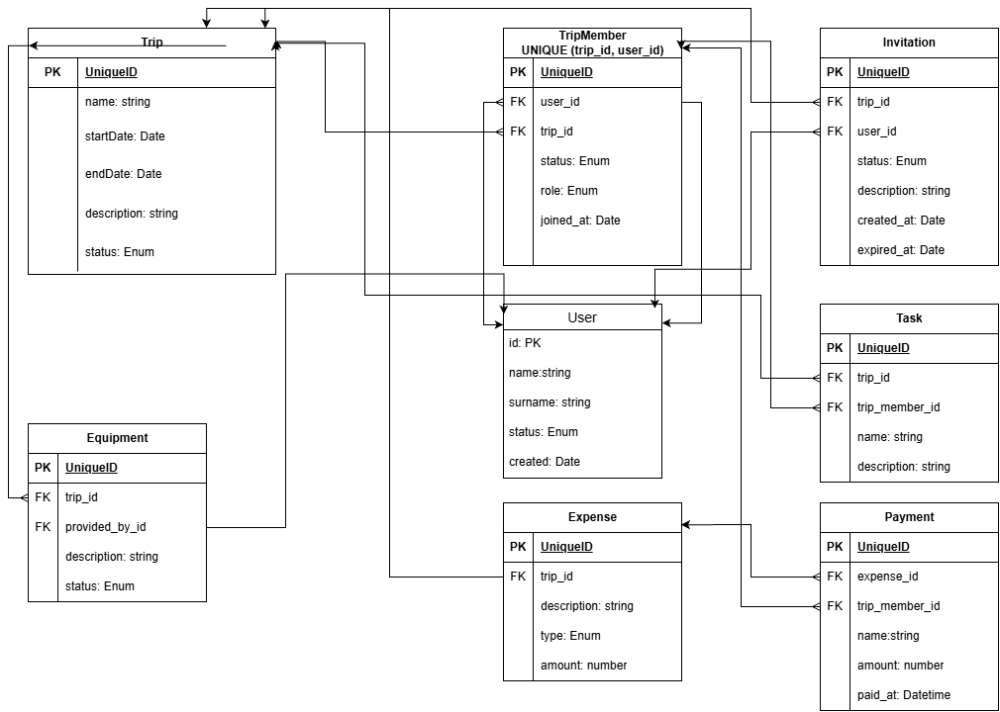

# Data Model
## 1. Domain Entities

### 1.1 User

	Represents a registered application user

	Responsibilities:
	- can participate in multiple trips
	- can own a trip through a TripMember relationship
	- can receive invitations to an expedition

### 1.2 Trip

	Represents a planned expedition/trip

	Responsibilities:
	- contains expedition details
	- manages participants
	- manages equipment
	- manages expenses
	- manages the expedition lifecycle

### 1.3 TripMember

	Represents an expedition participant

	Responsibilities:
	- links the user to the expedition
	- contains information about the participant's role(owner, member..) in the expedition
	- contains additional information required for the expedition
	
### 1.4 Task

	Represents tasks created for a specific expedition

	Responsibilities:
	- describes tasks within the expedition
	- identifies the person responsible for execution
	- includes the current task status

### 1.5	Equipment

	Represents the equipment required for the expedition
	Responsibilities:
	- lists equipment details
	- identifies the person who will supply the equipment

### 1.6	Eexpense

	Represents travel-related expenses

	Responsibilities:
	- includes details of the expenses

### 1.7 Payment

	Represents trip-related charges

	Responsibilities:
	- Includes payment details
	- Specifies the expenses covered by the payment
	- Identifies the user who incurred the costs
	- Provides payment data used to calculate travel expense settlements
	
### 1.8 Invitation

	Represents a user invitation to participate in a specific expedition.

	Responsibilities:
	- identifies the expedition and the invited user;
	- stores the invitation status;
	- allows the invitation to be accepted or rejected.

## 2. Entity Relationships

	- User – TripMember (1:N): A single user can be a member of multiple trips.
	- Trip – TripMember (1:N): A single trip can have multiple group members.
	  This relationship (combined with the previous one) establishes a many-to-many (N:M) relationship between User and Trip.
	- Trip – Invitation (1:N): Multiple invitations can be generated for a single trip.
	- User – Invitation (1:N): A single user can receive multiple invitations.
	- Trip – Task (1:N): Multiple tasks can be created for a trip.	- TripMember – Task (1:N): A trip member can have multiple tasks assigned to them.
	- Trip – Equipment (1:N): A trip has a list of required equipment.
	- TripMember – Equipment (1:N): A specific participant can provide required equipment.
	- Trip – Expense (1:N): Multiple group expenses are recorded for a trip.
	- Expense – Payment (1:N): A single expense can be covered by multiple payments..
	- TripMember – Payment (1:N): A trip member makes payments as part of expense settlements.

## 3. Relational Model

	The following description presents the mapping of a graphical model to a relational database table structure.

	User (id, name, surenme, status, created)
		- PK: id
	Trip (id, name, startDate, endDate, description, status)
		- PK: id
	TripMember (id, user_id, trip_id, status, role, joined_at)
		- PK: id
		- FK: user_id refers to User(id)
		- FK: trip_id refers to Trip(id)
		- Constraint: UNIQUE(trip_id, user_id)
	Invitation (id, trip_id, user_id, status, description, created_at, expired_at)
		- PK: id
		- FK: trip_id refers to Trip(id)
		- FK: user_id refers to User(id)
	Task (id, trip_id, trip_member_id, name, description)
		- PK: id
		- FK: trip_id refers to Trip(id)
		- FK: trip_member_id refers to TripMember(id)
	Equipment (id, trip_id, provided_by_id, description, status)
		- PK: id
		- FK: trip_id refers to Trip(id)
		- FK: provided_by_id refers to TripMember(id)
	Eexpense (id, trip_id, description, type, amount)
		- PK: id
		- FK: trip_id refers to Trip(id)
	Payment (id, expense_id, trip_memmber_id, name, amount, paid_at)
		- PK: id
		- FK: expense_id refers to Eexpense(id)
		- FK: trip_memmber_id refers to TripMember(id)

## 4. ER Diagram

## 5. Design Decisions

### DD-01 - TripMember
	Context:
	The application requires associating multiple users (User) with multiple trips (Trip); furthermore, users play different roles in an expedition, and we need to track details such as the date of joining.

	Decision:
	Instead of a simple many-to-many association table, an explicit "TripMember" table with its own unique ID was used. Other system elements (Task, Equipment, Payment) will be linked to this table rather than directly to the "User".

### DD-02 - Payment
	Context:
	Expeditions involve expenses that are either planned or paid. These include the amount, the payment date, and an indication of the person who made the payment.

	Decision:
	An expense represent a costs incurred before and during travel.
	A separate class ("Payment") was created for record who paid for which expense and how much.
	The settlement result is calculated based on expenses and payments.
	Settlement result is not stored as entity.	
	This supports partial payments.

### DD-03 - Equipment
	Context:
	Trip planning requires identifying the equipment needed for the journey and specifying who will provide it.

	Decision:
	Since equipment is not necessarily assigned to a person immediately—but may exist only in the planning stage—the "provided_by_id" link (pointing to "TripMember") is nullable.

